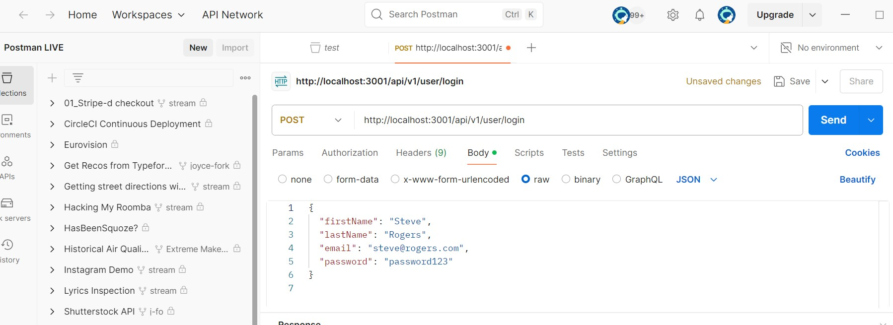
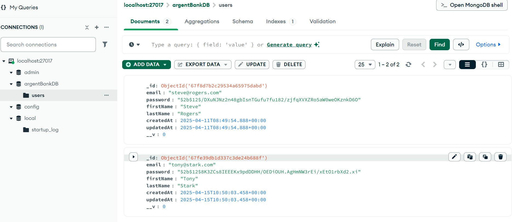

# Projet "Argent Bank"  

L'objectif de la mission consiste à implémenter le front-end d'une application bancaire en utilisant React.

## 🎯 Objectif :  

Vous venez d’intégrer Argent Bank comme développeur front-end. Argent Bank est une nouvelle banque en ligne qui souhaite percer dans le secteur bancaire. Vous travaillez avec Mila, la cheffe de projet, pour la mise en place du tableau de bord des utilisateurs.

Objectif premier mettre en place un dashboard :

    ** Utiliser React pour créer l'application **
    ** Site responsive **
    ** Utiliser React Router pour gérer les routes de l'application **
    ** Utiliser Redux pour gérer le state de l'ensemble de l'application **
    ** Mettre en place les bonnes pratiques du Green IT **
    ** Proposer les routes API pour les manipulations sur les transactions en utilisant Swagger **

    ## Comptes / Login

| Prénom | Nom    | Email            | Mot de passe |
| ------ | ------ | ---------------- | ------------ |
| Tony   | Stark  | tony@stark.com   | password123  |
| Steve  | Rogers | steve@rogers.com | password456  |

## 📱 Vues application réalisée ci-dessous :  

## 📱 Vue Test Postman réalisé :  

## 📱 Vue mongoDB :  

## 📋 Installation du projet :  

### Prérequis

- **Visual Studio Code** : code editor
- **Node** : for running commands
- **Git** : for creating repositories and commits
- **React** : a JavaScript framework for websites development
- **React-router-dom** : the navigation library for React `npm install react-router-dom`
- **Prop-types** : define your components props types `npm install prop-types`
- **Axios** : Make API requests with Axios `npm install axios`
- **Redux-Toolkit** : Manage your state application with Redux-Toolkit `npm install @reduxjs/toolkit`

### Installation et lancement du _Back-End_

1️⃣ Clonez le repositorie _ArgentBank_ : 
`git clone https://github.com/nebulot/Nebulotelodie_ArgentBank` 
2️⃣ Allez dans votre terminal, puis ouvrer : 
cd Back-End 
3️⃣ En se plaçant dans ce repo du _Back-End_, installer ses dépendances : 
'npm install' 
4️⃣ Lancer le _Back-End_ sur le port 3000 (port par défaut) 
puis => 'npm run dev:server' 

### Installation et lancement du _Front-End_

1️⃣ Clonez le repositorie _SportSee_ : 
`git clone https://github.com/nebulot/Nebulotelodie_SportSee` 
2️⃣ Allez dans votre terminal, puis ouvrer : 
cd Front-End 
3️⃣ En se plaçant dans ce repo du _Front-End_, installer ses dépendances :  'npm install' 
4️⃣ Lancer le _Front-End_ sur le port 3001 (port par défaut 3000 utiliser par votre Back-End votre terminal va donc vous demandez de prendre le port suivant (Y/O) => selectionner Y) 
puis => 'npm start' 

Le _front-end_ est alors consultable à l'URL `http://localhost:3001`.

## 💻 Developper avec :  

Visual Studio Code - Éditeur de texte 
Sass - Préprocesseur CSS 
React 18 - Bibliothèque JavaScript gratuite et open-source développée par Facebook 
Create React App - Outil créé par Facebook, qui est la référence pour initier un projet React 
React Router V6 - Bibliothèque de routage pour React 
Recharts - Bibliothèque de graphiques pour React 
Prop-types - Package utilisé pour documenter les types de propriétés attendus dans les composants React 
JSDoc - Générateur de documentation pour JavaScript 
GitHub - Outil de gestion de version 
GitHub Pages - Outil d’hébergement 

\*\*🔗 Liens :  

=> W3C validator
[Liens W3C](https://validator.w3.org/nu/?doc=https%3A%2F%2Fnebulot.github.io%2FNebulotelodie_SportSee%2F)

---

# "SportSee Project"  

The SportSee application, a startup dedicated to sports coaching.

## 🎯 Goal :  

The project is to develop an analytics dashboard using React.
This demo highlights the dashboard of a selected user; for testing purposes, we will use only two users.
The company is launching a new version of the user profile page. This page will allow users to track the number of sessions completed and the number of calories burned.

Use the toggle button to switch between user 12 and user 18, then click on Profile.

## 📱 Figma mockup view below: :  

[Figma Link](https://www.figma.com/design/BMomGVZqLZb811mDMShpLu/UI-design-Sportify-FR?node-id=0-1&p=f&t=Z9RwXQsRR5o0TR4p-0)

## 🗂️ Provided elements: :  

    UX/UI Figma mockups
    Back-End repository to fork below
    [Back-End](https://github.com/OpenClassrooms-Student-Center/SportSee)
    The SportSee API only provides data for users 12 and 18.
    The _Back-End_ ReadMe contains information on installation and Docker setup.
    [Back-End](https://www.docker.com/products/docker-desktop/)

## 📋 Project installation: :  

### Prerequisites

- [NodeJS (**version 12.18**)](https://nodejs.org/en/)
- [npm](https://www.npmjs.com/)

Installing and running the Back-End

1️⃣ Clone the SportSee repository: 
git clone https://github.com/nebulot/Nebulotelodie_SportSee  
2️⃣ Open your terminal, then navigate to: 
cd Back-End  
3️⃣ Inside the Back-End repository, install dependencies:  
npm install  
4️⃣ Start the Back-End on port 3000 (default port):  
npm run start  
Installing and running the Front-End  

1️⃣ Clone the SportSee repository:  
git clone https://github.com/nebulot/Nebulotelodie_SportSee  
2️⃣ Open your terminal, then navigate to:  
cd Front-End  
3️⃣ Inside the Front-End repository, install dependencies:  
npm install  
4️⃣ Start the Front-End on port 3001 (default port 3000 is used by the Back-End; your terminal will prompt you to switch to the next available port (Y/O) → select Y): 
npm start 

The Front-End is now accessible at http://localhost:3001.
💻 Developed with:  

Visual Studio Code - Text editor  
Sass - CSS preprocessor  
React 18 - Free and open-source JavaScript library developed by Facebook 
Create React App - Toolkit created by Facebook, which is the reference for initiating a React project  
React Router V6 - Routing library for React 
Recharts - A charting library for React 
Prop-types - A package used to document the intended types of properties passed to React components  
JSDoc - Documentation generator for JavaScript  
GitHub - Version control tool  
GitHub Pages - Hosting tool  
\*\*🔗 Liens :  

=> W3C validator
[ W3C Link](https://validator.w3.org/nu/?doc=https%3A%2F%2Fnebulot.github.io%2FNebulotelodie_SportSee%2F)
